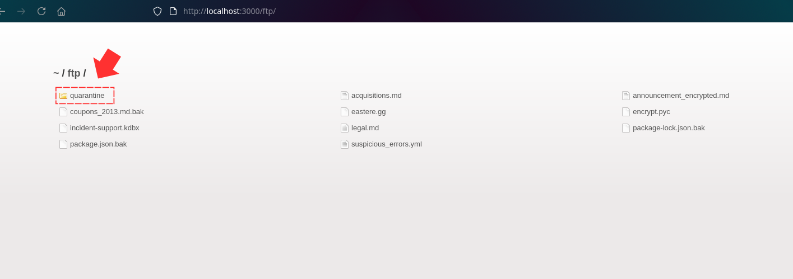
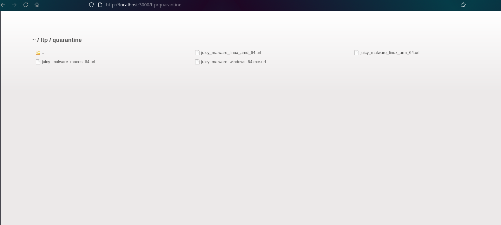
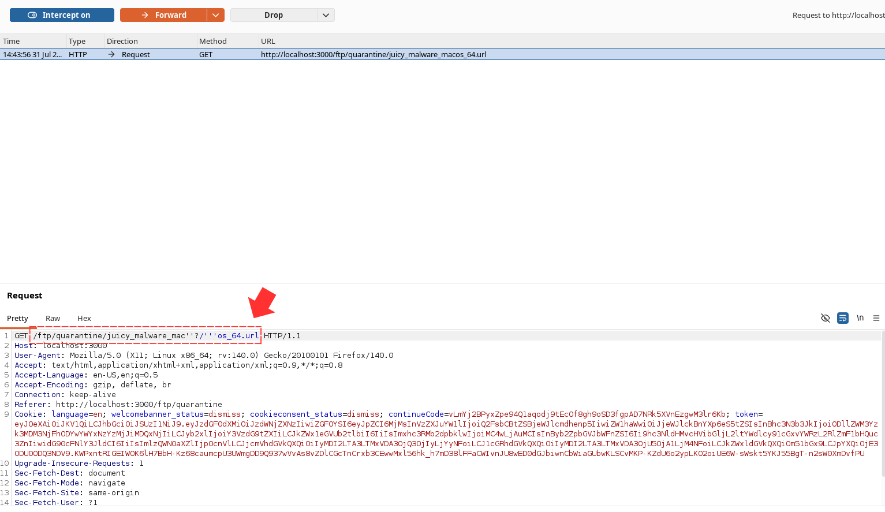
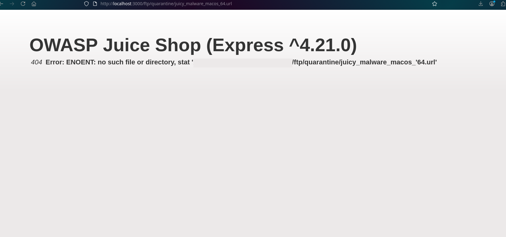
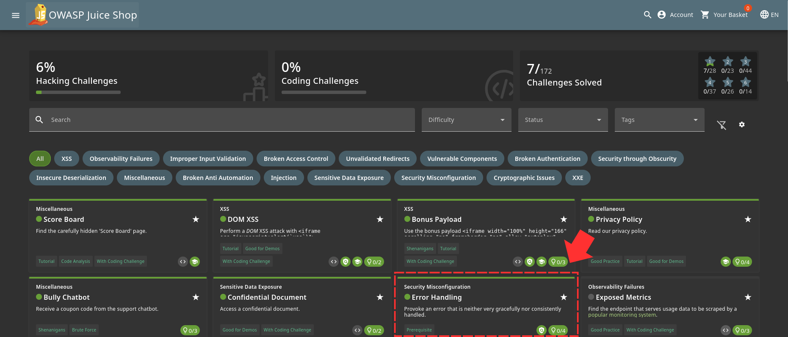

This is a continuation from the previous challenge [Confidential Document](../Confidential_Document/readme.md).

Still in the ftp directory, you will see a quarantine folder. So i guess we have to click on it 

Inside it, we find 4 different files 

So to trigger an Error, we modify the request for one of the files in burpsuite and then forward it 

This successfully triggered an error that reveals some vital information about the application 

Just like that, Another challenge in the bag 

