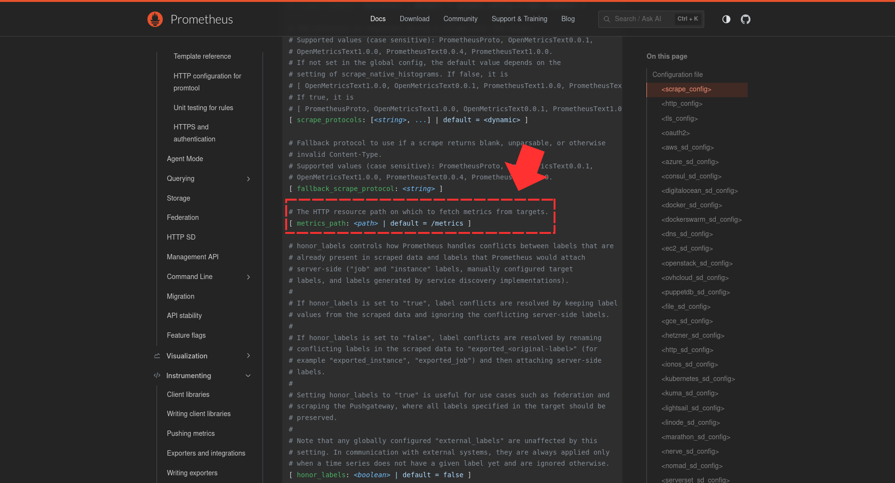
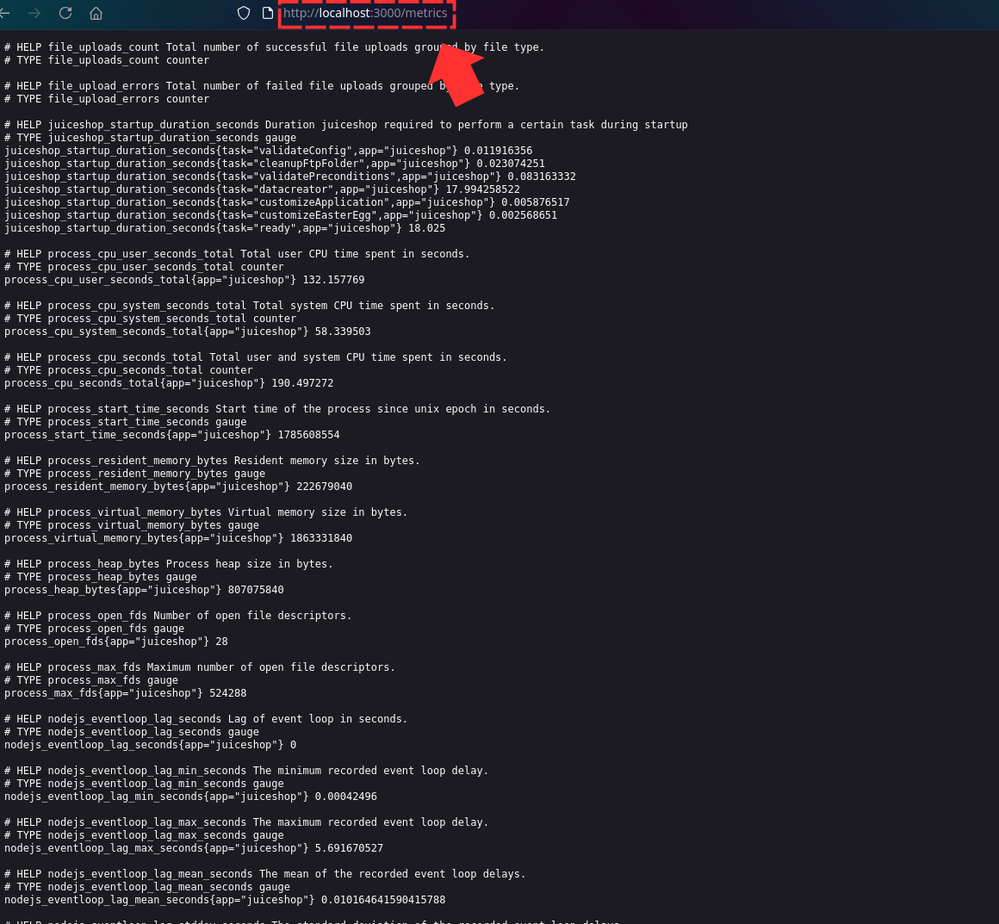
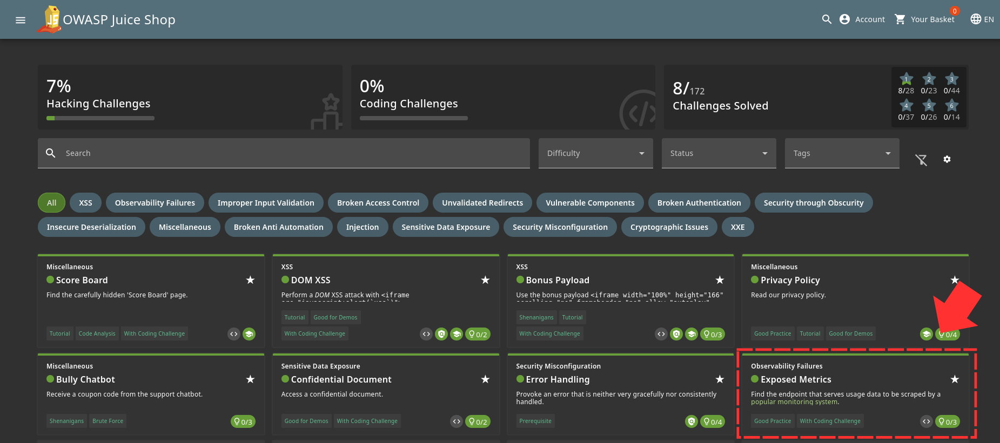

Prometheus is a popular monitoring system for programs that use node.js

Checking the documentation of Prometheus, a default path for metrics is found 

When tested on JuiceShop, It works and exposes the metrics 

Another Challenge Solved 
