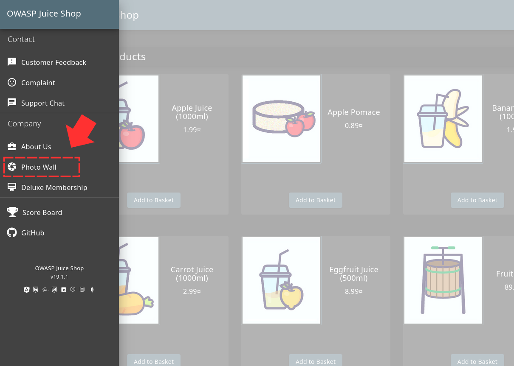
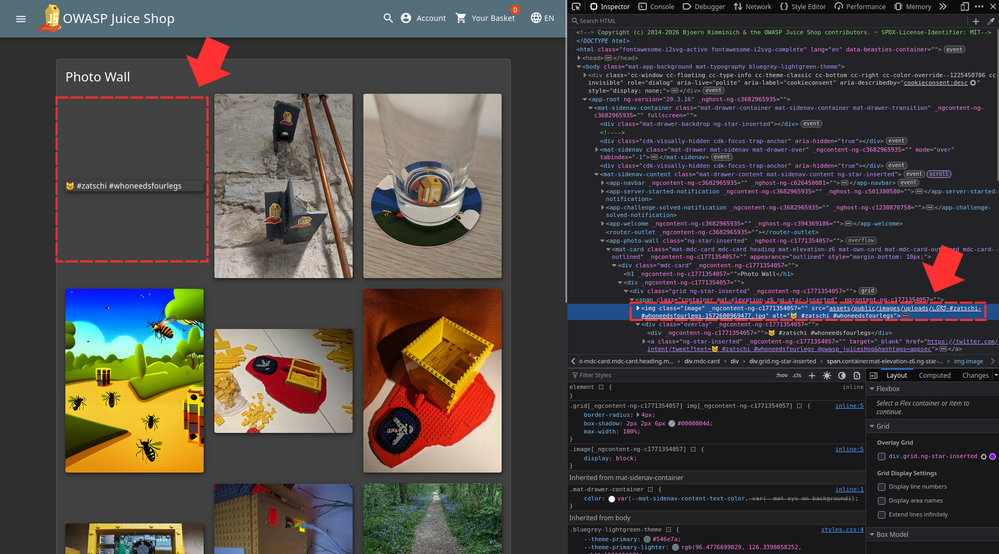
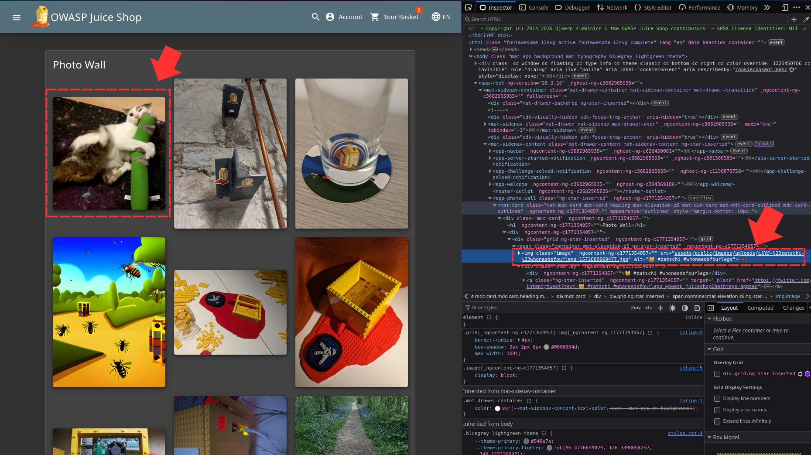
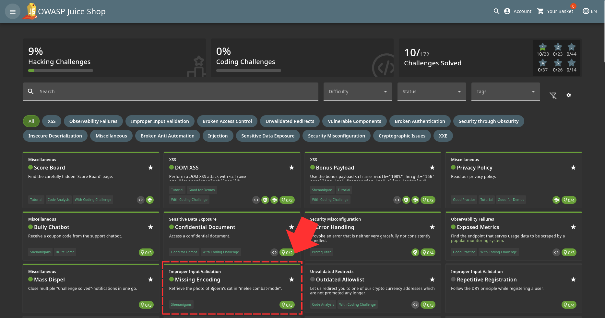

First thing to do is to navigate to the side menu in the home page and click on "Photo Wall" 

There you will notice there is an image missing and if you loading it, the application does not cuts of the URL from where "#" begins 

If you URL encode the "#" symbol, you notice that the image appears 

And then, the challenge is solved 
