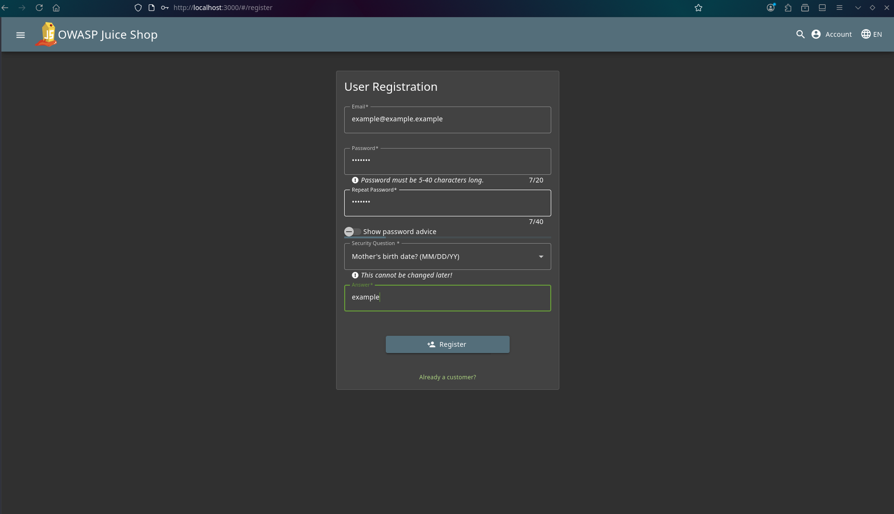
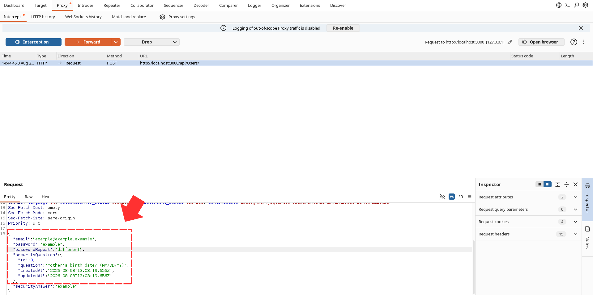
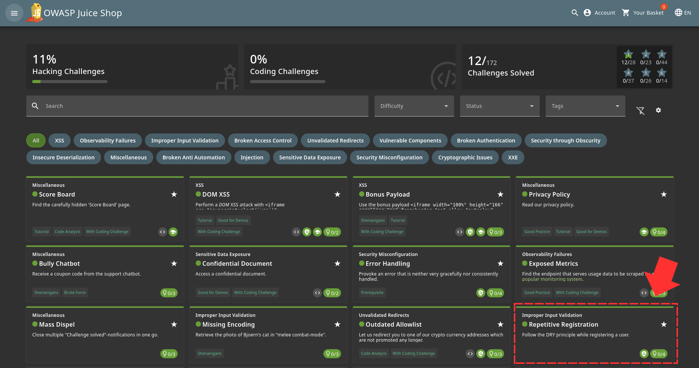

The DRY principle which stands for "Dont Repeat Yourself" simply tells us that when registering, we should not repeat the same password even though it strictly asks to do so.

So firstly, we navigate to register page 

Then after filling in all the details, you can simply intercept the request with burpsuite and modify it before forwarding 

Challenge Solved! 
