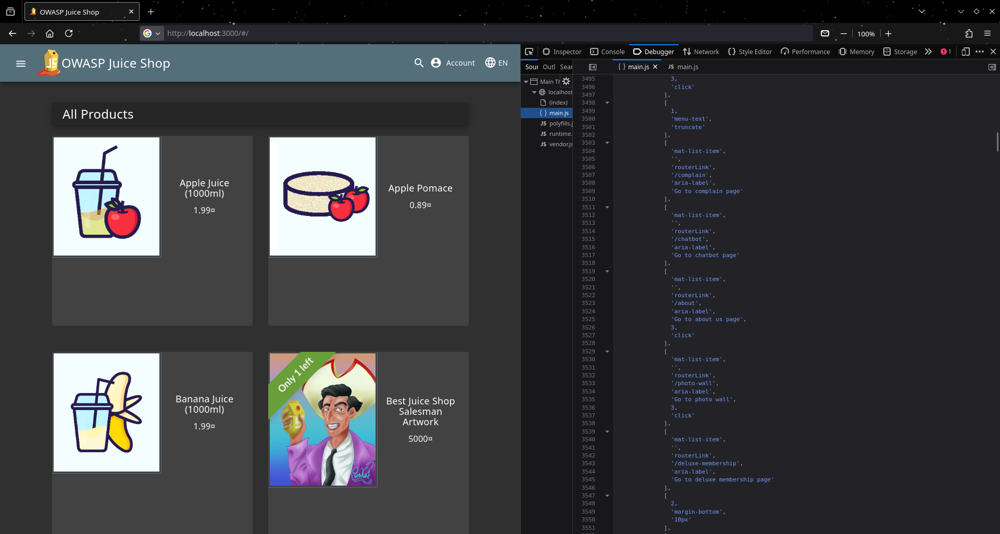
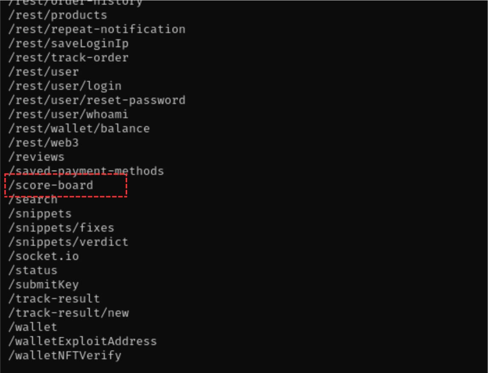
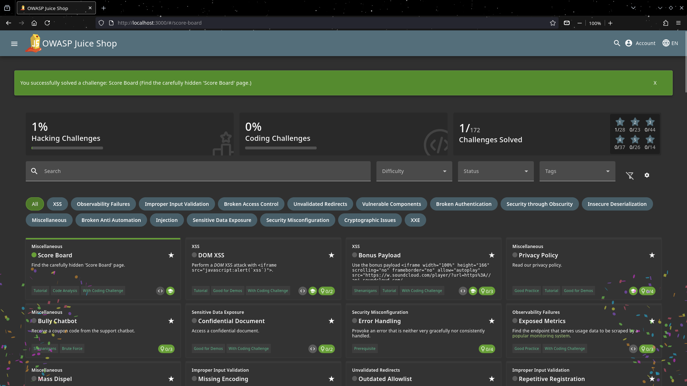

# Challenge 1

When you navigate to the home page, you can quickly go to the devloper page and then head on to the debugger where you can analyse the Javascript file as show in this image 

I personally designed a program to scan SPAs like this. You can find it at [Script For Scanning](tools/scanner.py). And this was the result is in the text file [Paths In Tool Result](tools/dirs.txt)

And then when you navigate to the score-board path that was found , you will successfully complete the challenge 
