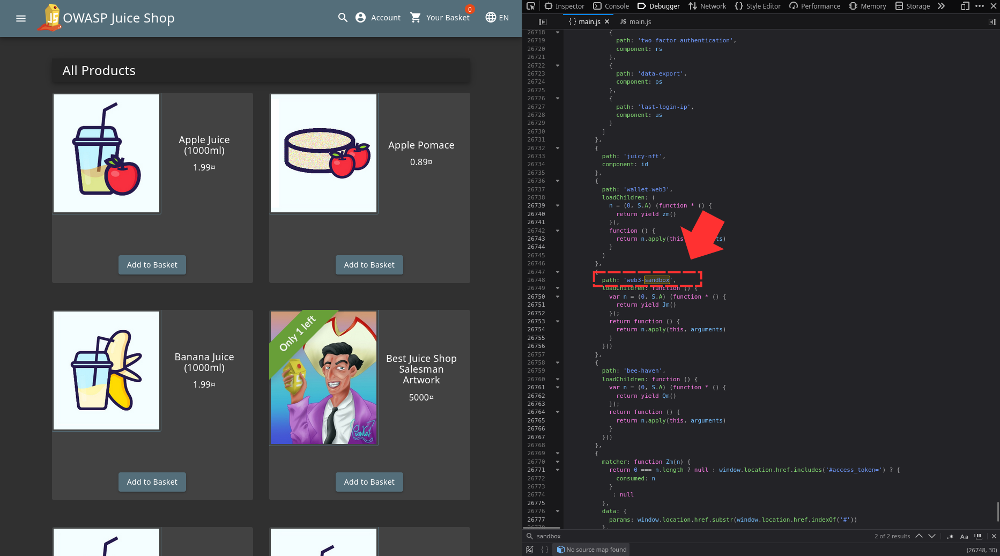
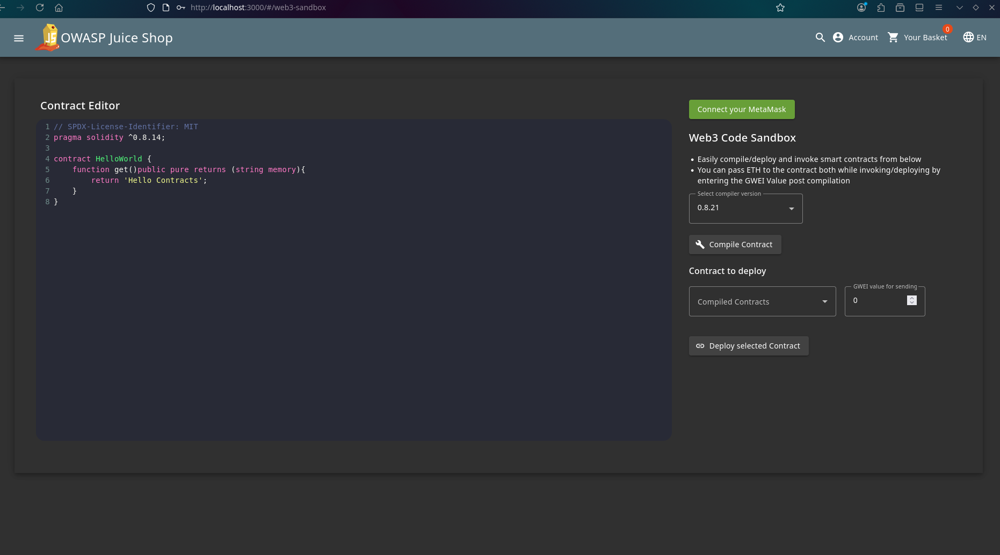
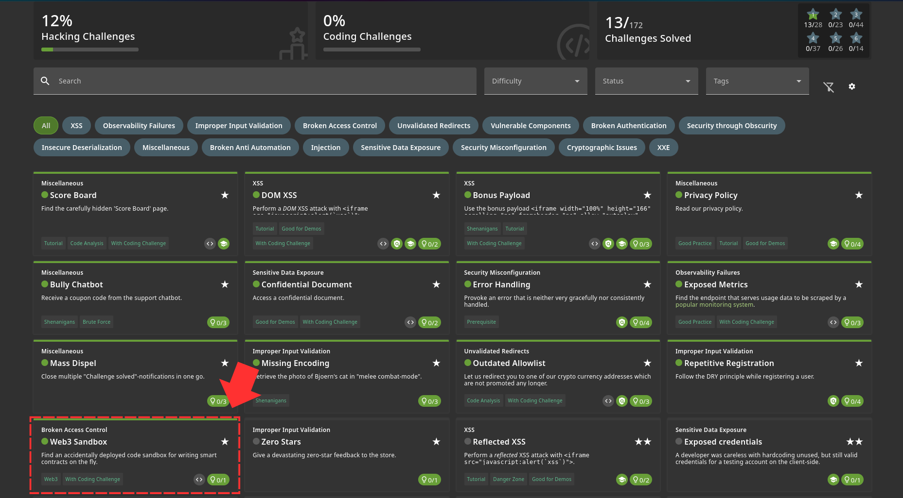

In this challenge, simply searching for "sandbox" in the main.js file you'll see a path there 

Once you access the path, it takes you to the web3 code sandbox page 

And that solves your challenge 
