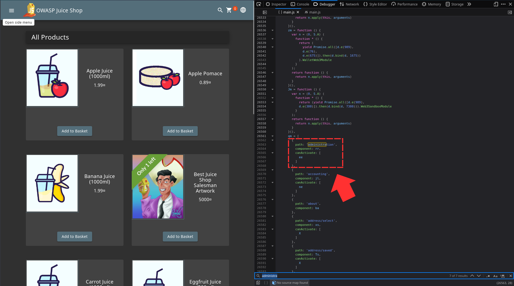
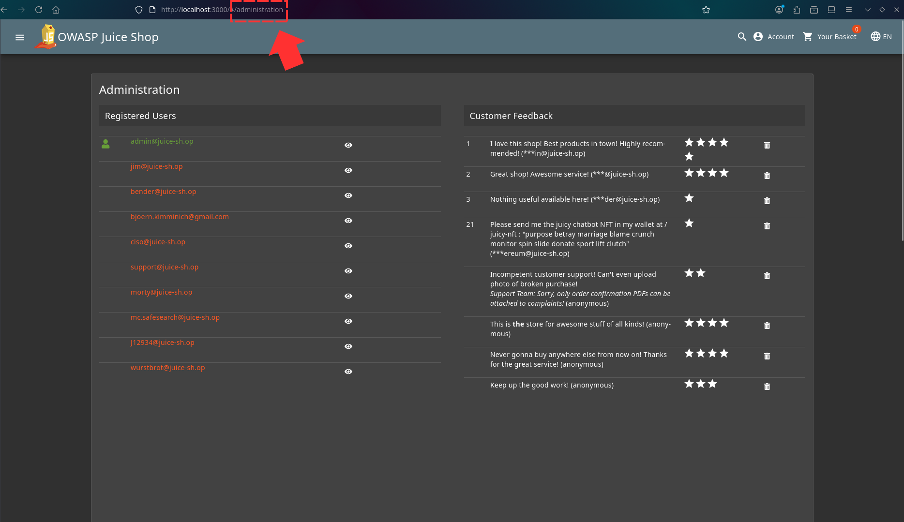
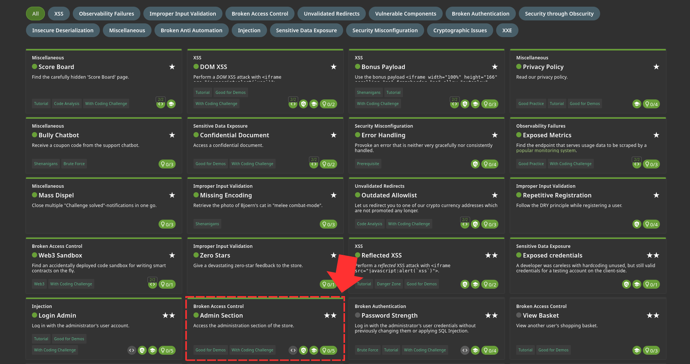

After a successful login as the admin, For the administration section, 
I tried searching for anything that has to do with "administration" in the main.js file and something interesting came up 

So I had to try going to that path and found out it works 

Challenge solved! 
