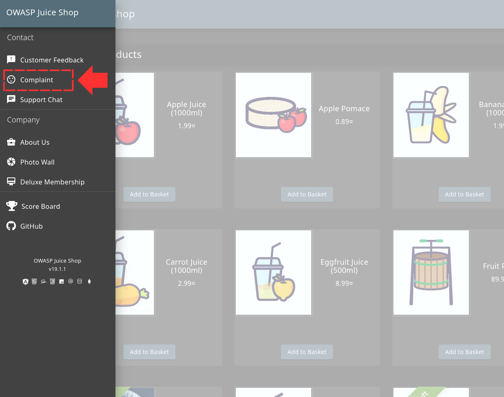
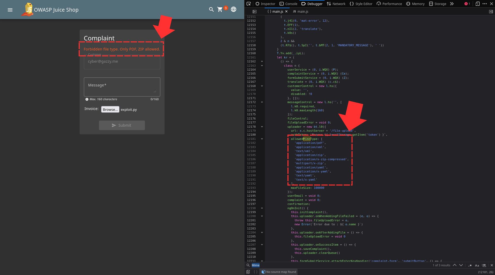
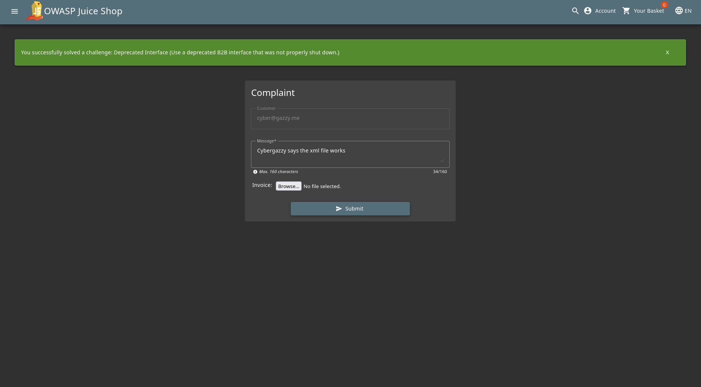
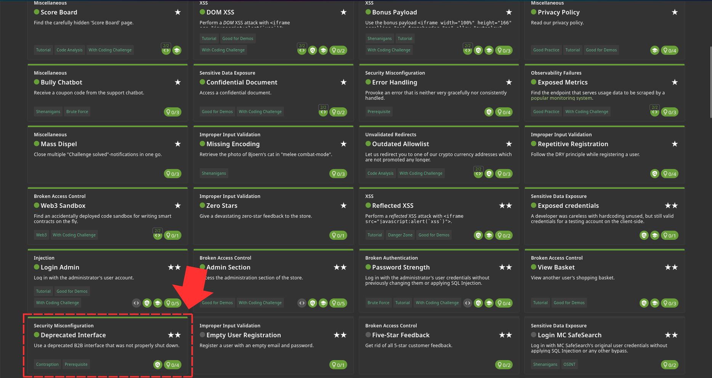

Alright, first thing you want to do is to navigate to "Complaint" in the side menu 

In this page, I already tried putting a python file to test the vulnerability but that didnt work so i decided to check for the allowed mime types in the main.js file and found these 

I then uploaded an xml file and guess what, It works! And that solved the challenge 

Challenge Solved! 
