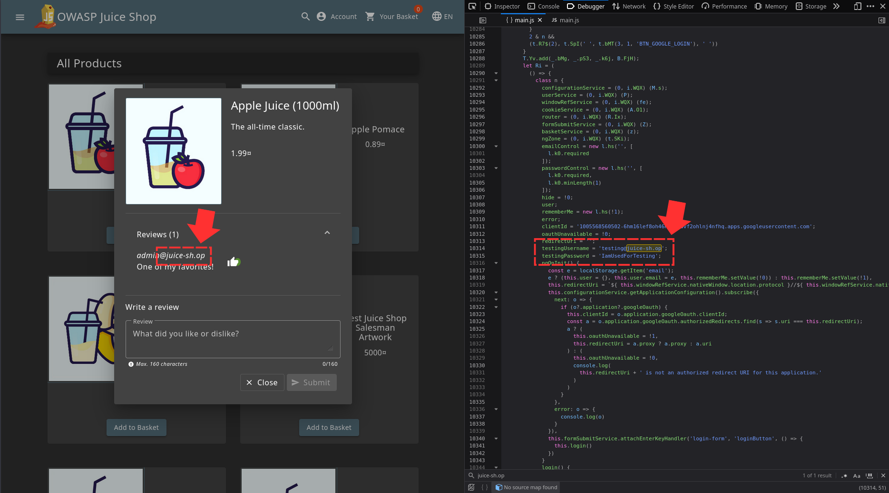
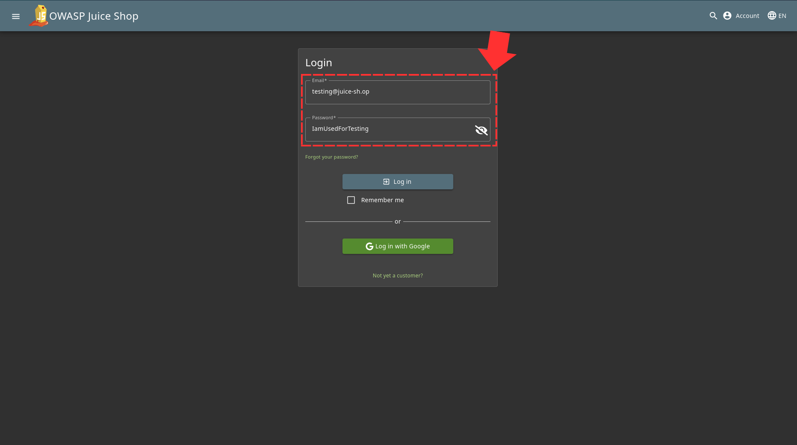
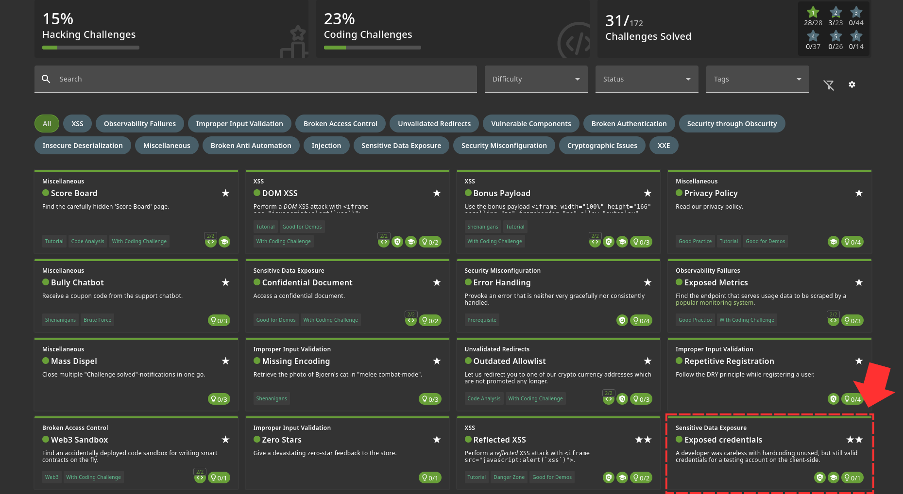

After discovering that most of the official emails use the company email "juice-sh.op", I decided to search for that in the main.js file and found something interesting 

Once you login with those credentials, you solve the challenge 

Challenge Solved! 
