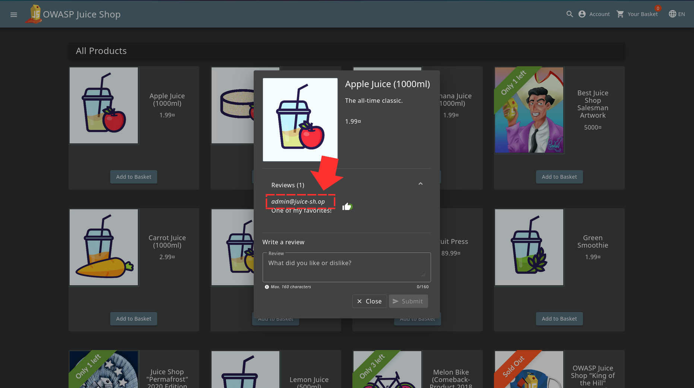
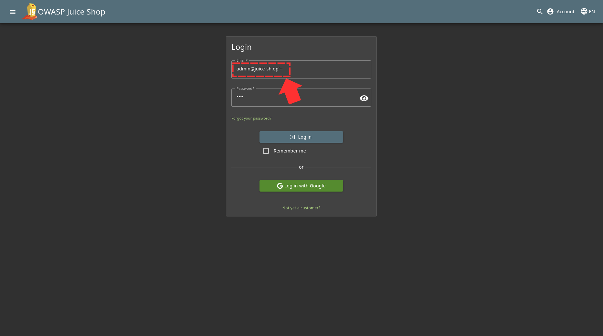
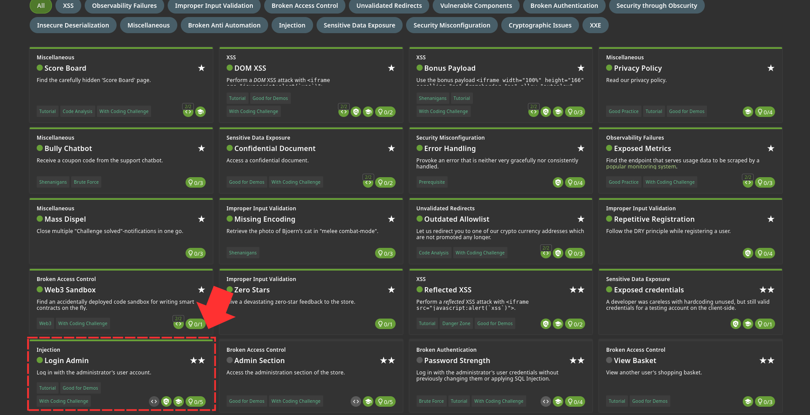

While going through the reviews, one of the emails caught my attention cause it had "admin" in it 

So I decided to use the basic SQLi method I know which is to comment out every other statement after your input. 

Challenge completed! 
