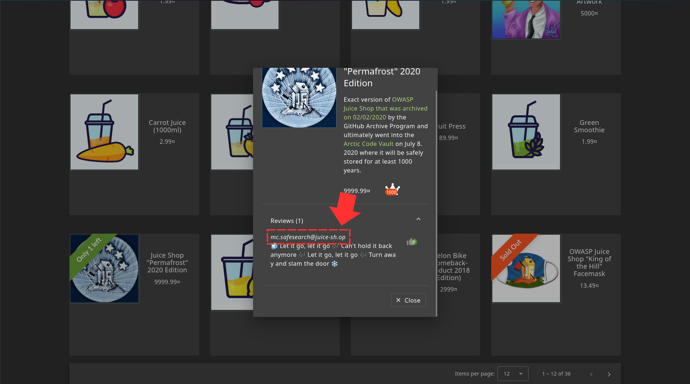
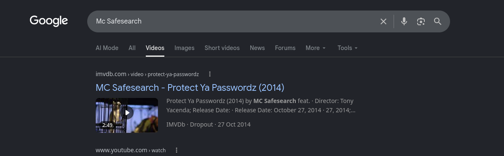
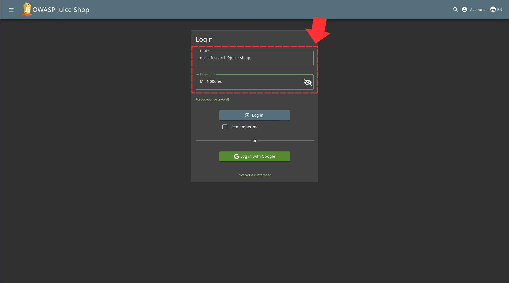
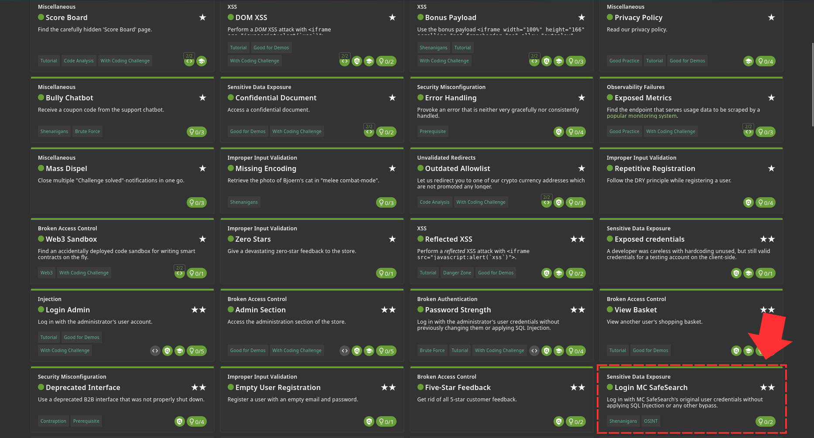

First thing we want to do is to find out Mc SafeSearch's Email which i found in one of the reviews 

And for the password, I used a little OSINT to find out about our guy and discovered this song 

It clear that is password is his dog's name, "Mr. Noodles" but the o's replace with 0's which makes that "Mr. N00dles". And once we login with that 

Challenge Solved! 
