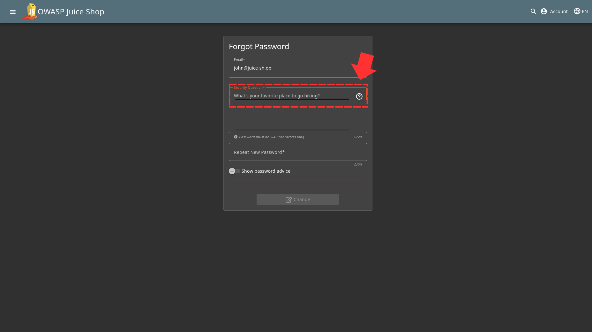
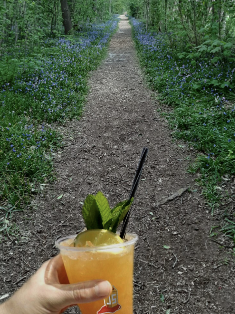
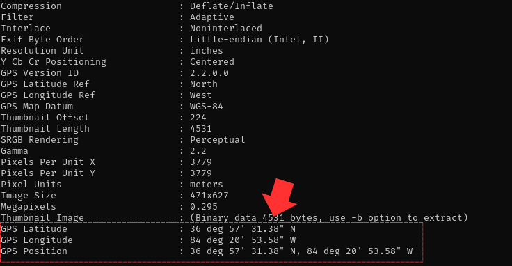
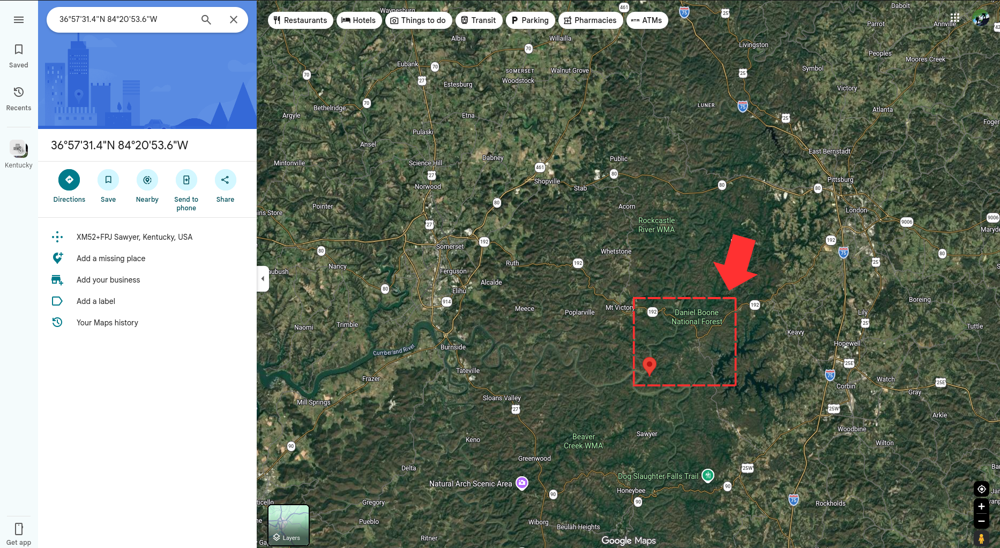

For this challlenge, first thing you want to do is find out what the security question of john is which we figured ont in this image 

So now we head over to the photo wall and you'll see this image there 

We are going to get information from the image using the "exiftool" to extract metadata. After you do that you will notice the gps position 

So if you search that up on google maps, you will notice the name of a resort there 

And then once you type in "Daniel Boone National Forest" as the answer to the security question and submit with the other details filled, you will solve that challenge

Challenge Solved! 
