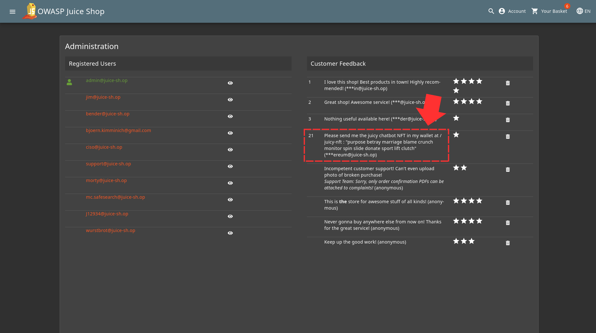
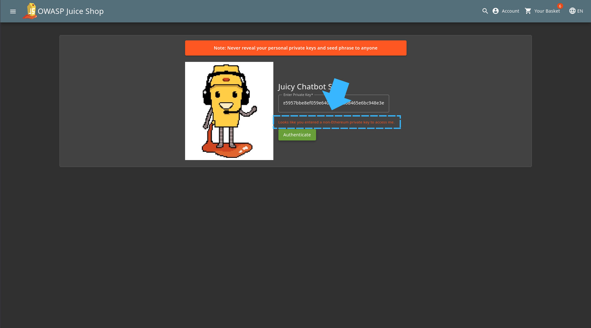
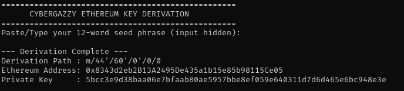
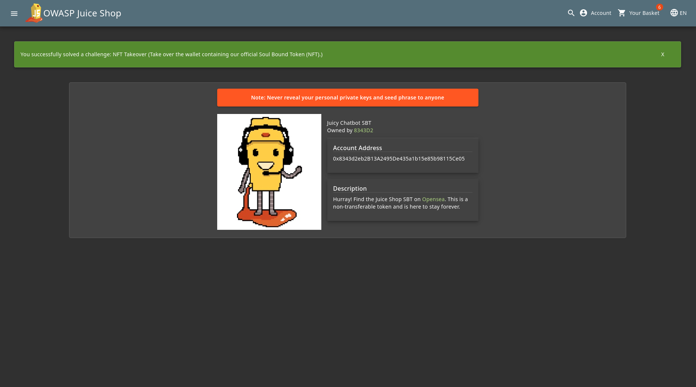

Go back to the administration page just like we did before [Admin_Section Challenge](../Admin_Section/readme.md)

You will notice a certain feedback written by a user that gives away a path and 12 random words which already gives us a lot of information 

So what we want to do is to first access that path. You'll notice an input box there and when i tried submitting random letters it gave an error message "Looks like you entered a non-Ethereum private key to access key" which now makes us know it requires an Ethereum private key 

I wrote a tool to convert those 12 words to an Ethereum private key using python. You will find the key at [Ethereum Key Generation](tools/eth-derive.py)

You can see the result I got from the tool 

So all you have to do is write 0x first in thr input box then paste the Private Key. After you do that, the challenge will be completed 

Challenge Solved! 
