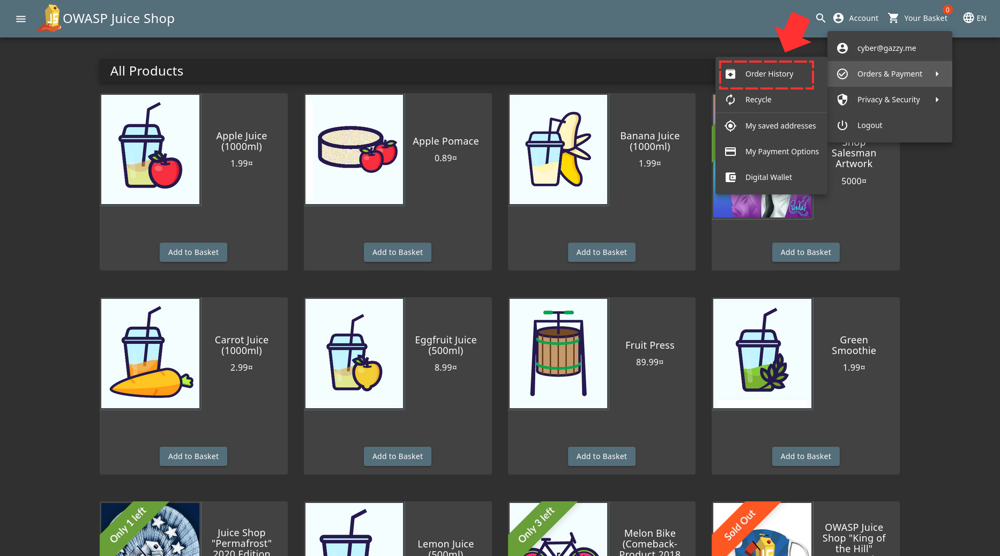
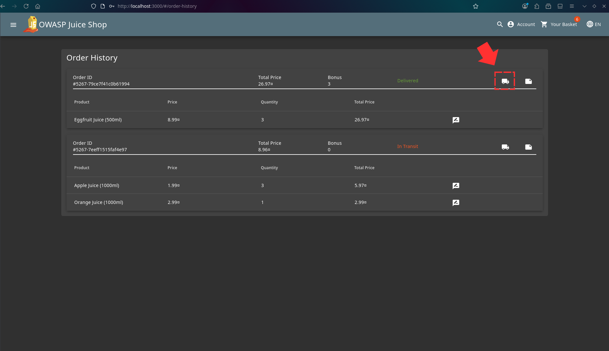
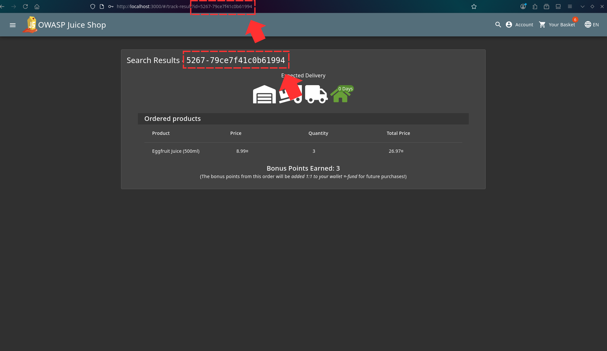
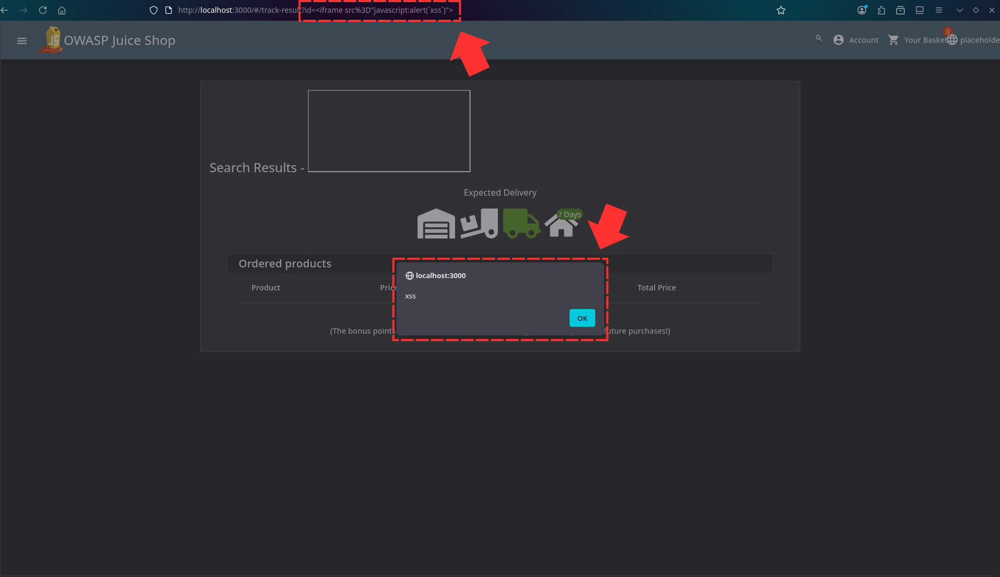
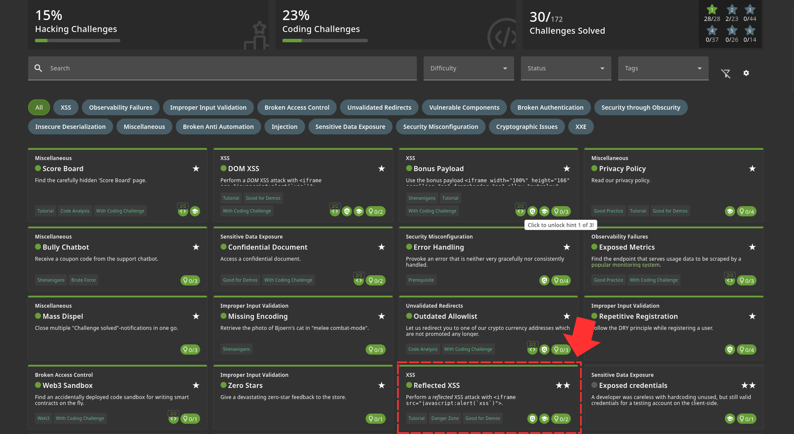

First thing you need to do is shop for some items and then place an order. When you're done, you have to go to "Order History" 

You can then track your order by clicking that button that has a truck 

When you click that, you notice that your tracking ID is put after a parameter in the URL but that's not all. It also shows in the page which is perfect for testing Reflected XSS 

So we can try inputing our payload into that parameter and once you refresh the page, this happens 

Challenge solved! 
