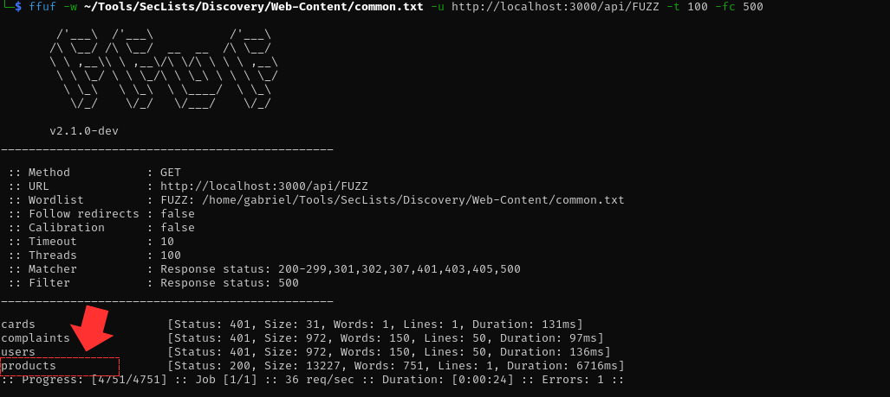
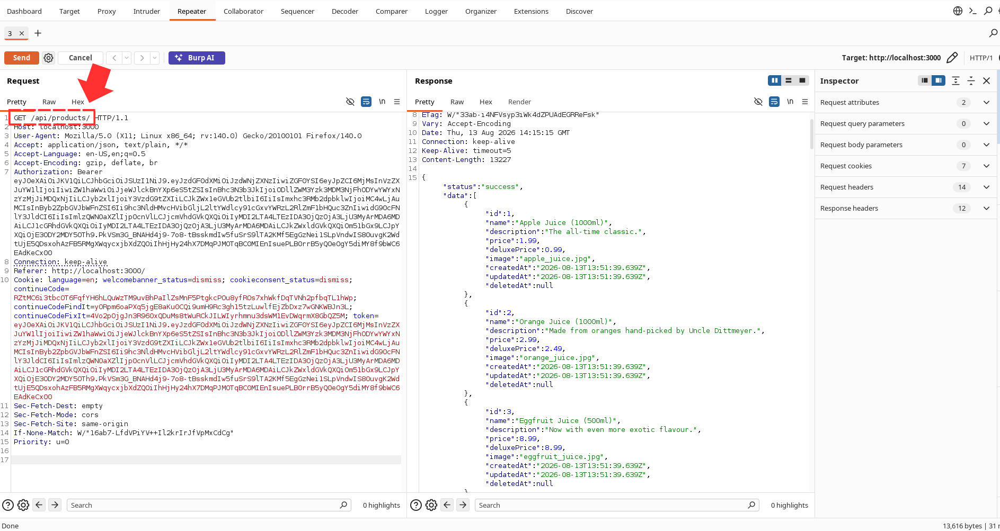
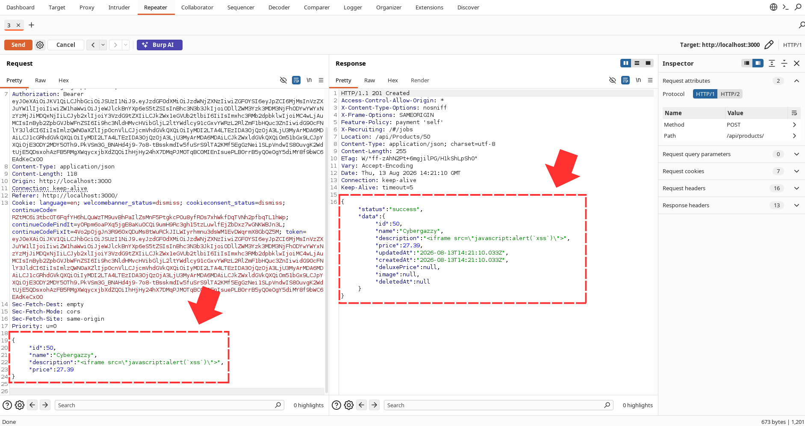
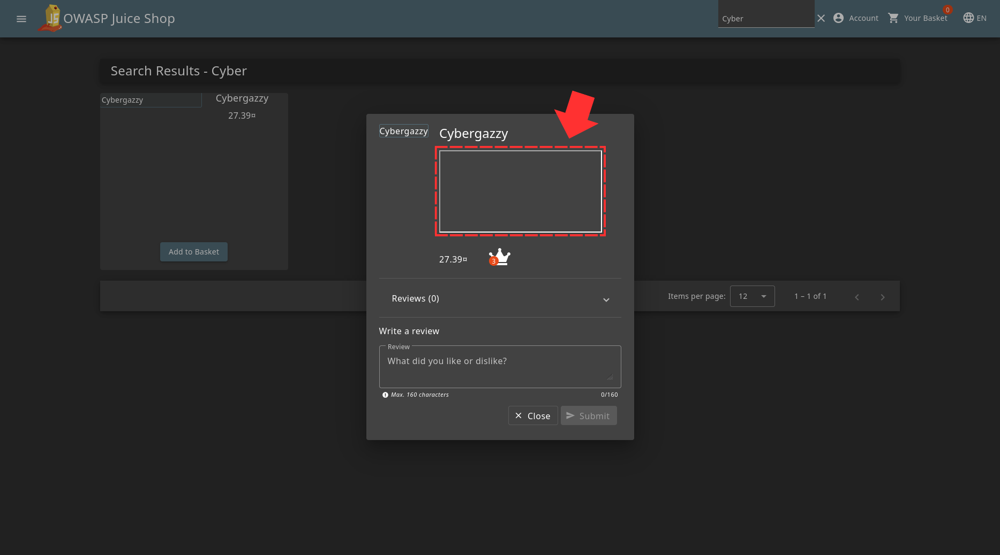

First thing you want to do is to find the possible api path you can visit by using the ffuf tool. After doing that you'll notice that the /product path is the best for this 

So, to determine how we structure our POST request, we first have to see the structure which we will do in burpsuite 

Now that we understand the structure, we can organize our POST request with the payload 

And now if we try to search for the file "Cybergazzy", you'll notice a empty product and an alert pop up with the alert 

Challenge Solved! 
