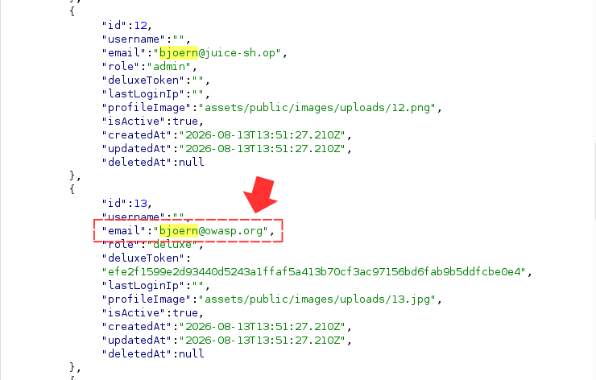
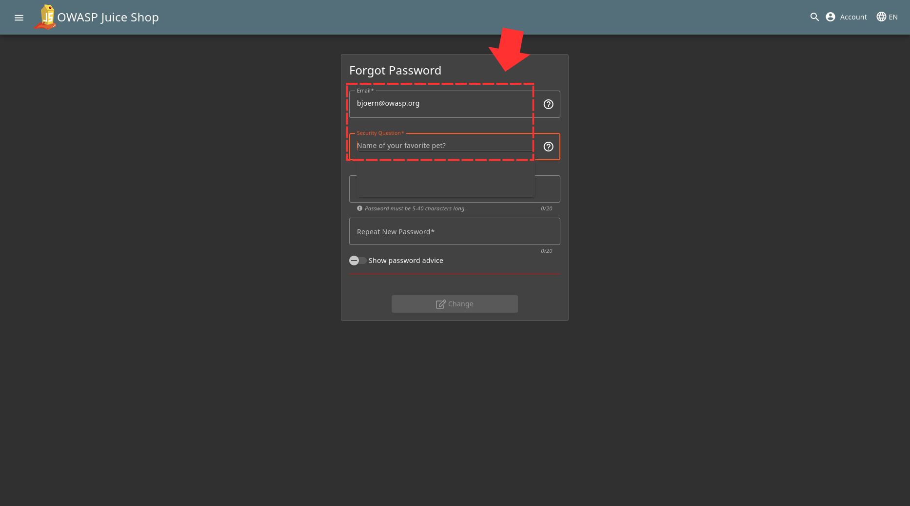
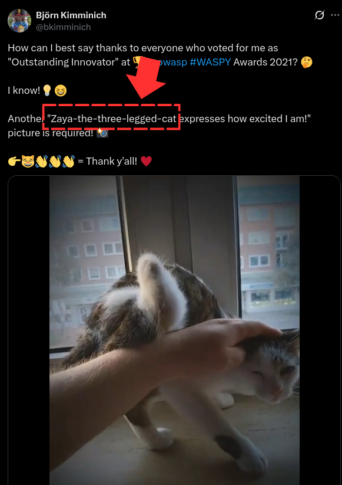
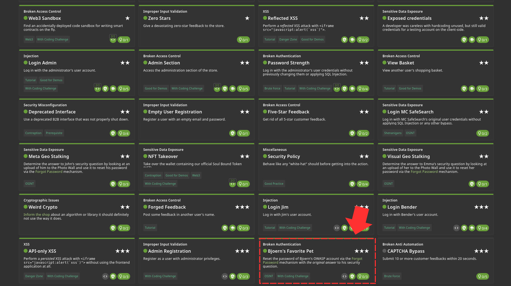

Okay...after going through /api/Users, you'll find 3 different emails owned by bjoern. But after testing them all I discovered the main one we will be using "bjoern@owasp.org" 

So if we head on to the forgot password page and input the email, you'll notice the question "Name of your favourite pet" 

Using OSINT, I was able to locate our guy on X, and saw a post where he typed "Zaya-the-three-legged-cat" 

Now head back to the "Forgot Password" page and fill in "Zaya" in the question field. Submit the form with all other details and you will solve the challenge

Challenge Solved! 
