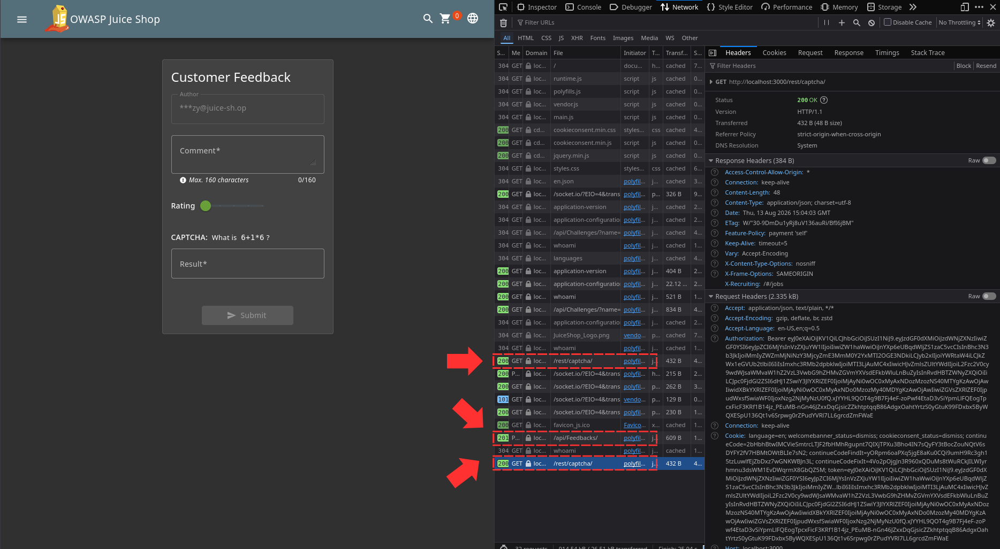
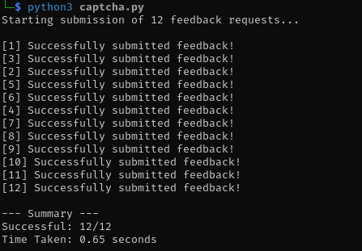
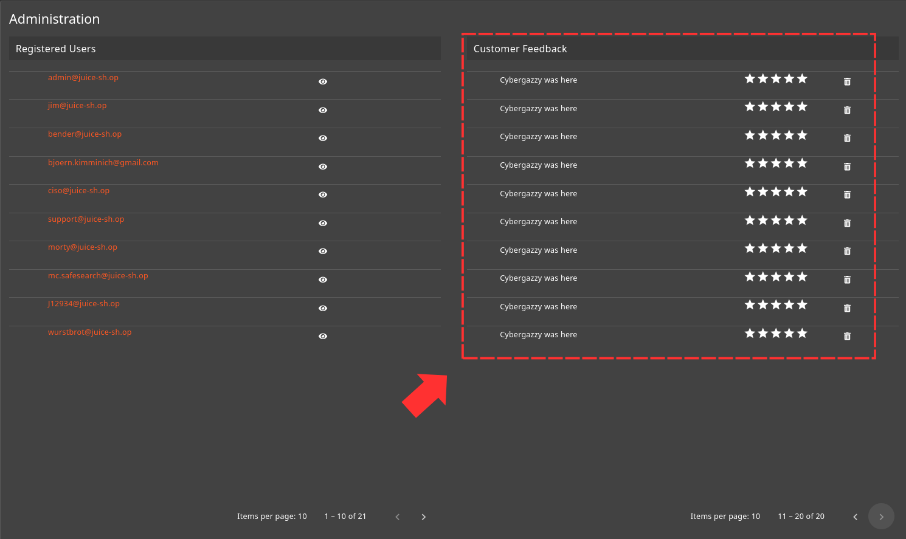
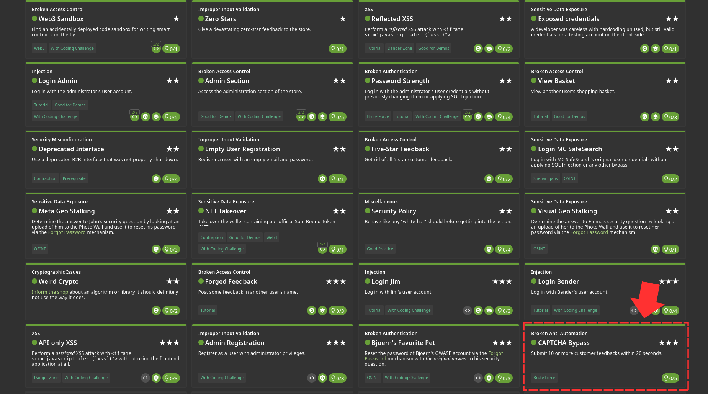

Go to the feedback page from the side menu and open your 'developer tools -> Network'. Send a normal feedback and notice that it already leaves us with a captcha amswer before we even fill it.

I will highlight 3 paths for you to look at after sending the form 

After going through them, I was able to create a tool that extracts the captcha answer, fill in the fields and send it to api/Feedbacks/. You'll find tool at [Captcha Tool](tools/captcha.py)

This is the tool at work 

And this is to show that the tool did it's job 

Challenge Solved! 
