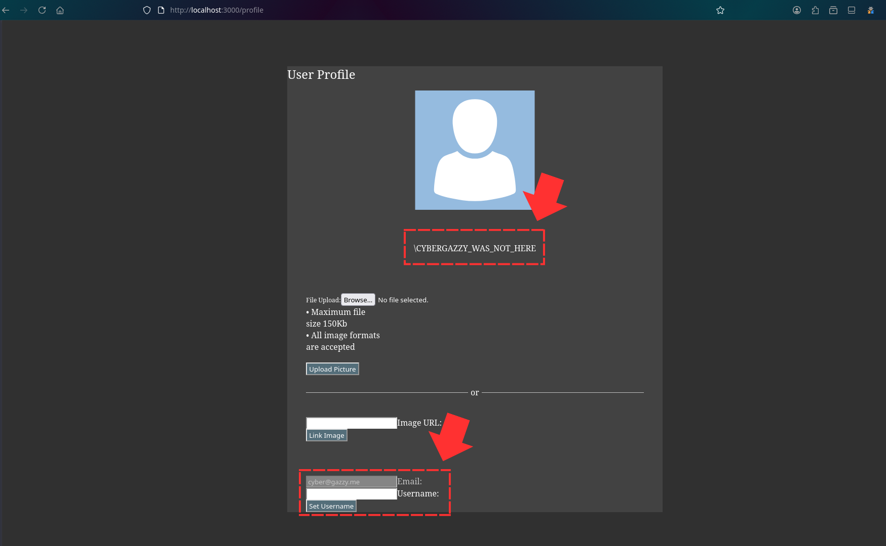
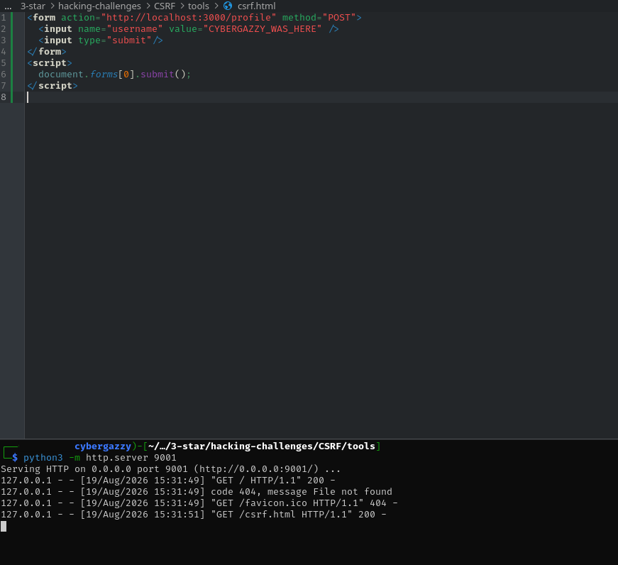
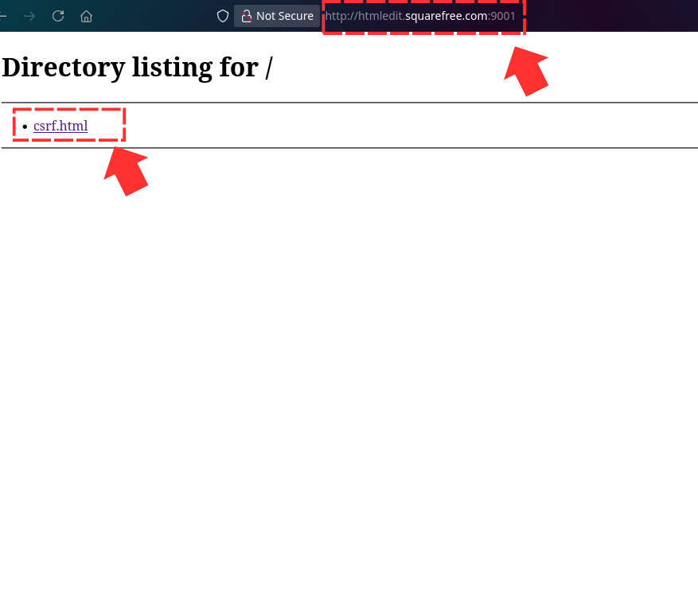
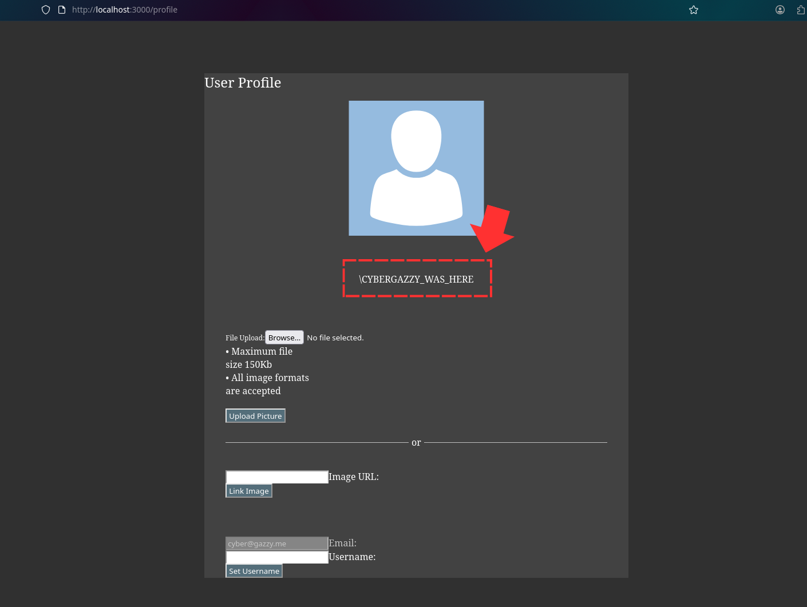
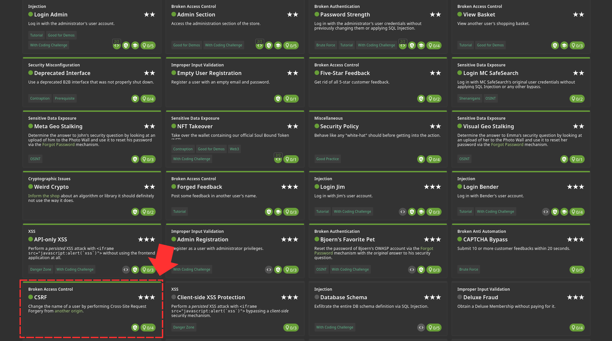

I will love you to head on to the profile page first and you'll notice that you can change the username 

Since we are meant to test it from a different origin, you don't have to mess with anything online. You can modify your hosts file and set the 'htmledit.squarefree.com' to 127.0.0.1 

Once that is done, you can simply craft an html payload that will redirect back to the juice-shop application profile page and change the name. THen, run the python server just like i did here 

You will the navigate to http://htmledit.squarefree.com:<port> and find the file there 

And once you click on that, it takes you straight to juice-shop back and you'll notice the name change 

Challenge Solved! 
