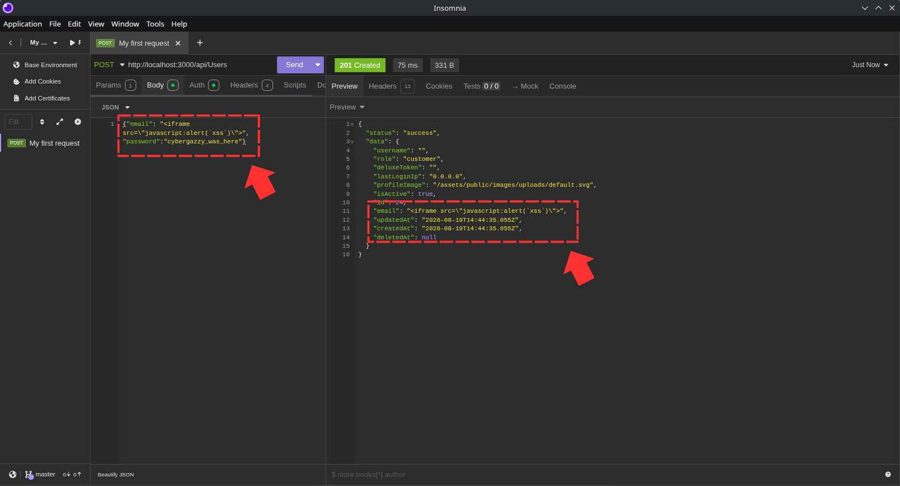
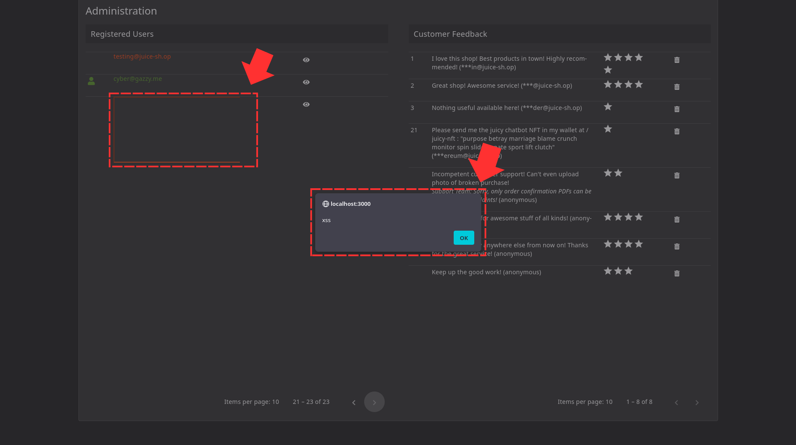
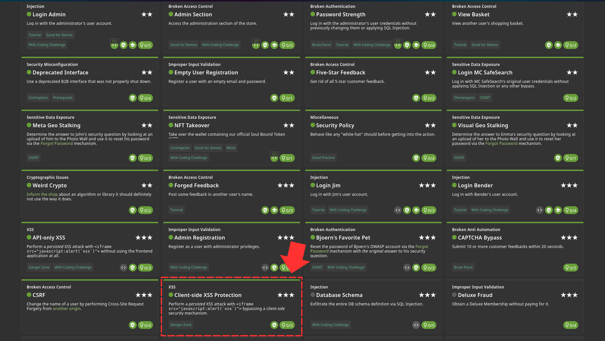

Since we already know the structure for the users table, We can send a POST request to the api/Users using a tool called Insomnia 

Once that is done, you can head on to the /administration page and you'll see the alert 

Challenge Solved! 
